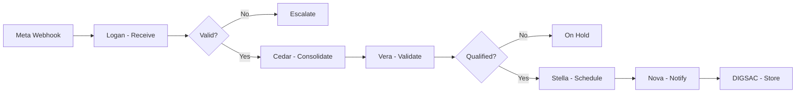

# 🎯 DIGSAC Lead Squad

**Auto-qualificação e agendamento de leads desde campanhas Meta (Instagram/Facebook) até reuniões Zoom.**

---

## 📋 Overview

Este squad automatiza o fluxo completo de leads:

1. **Meta Webhook** → Recebe leads de campanhas Instagram/Facebook
2. **Consolidação** → Extrai e normaliza dados
3. **Validação** → Qualifica e detecta duplicatas
4. **Agendamento** → Cria reunião Zoom + Zoom Calendar
5. **Notificação** → Envia confirmação + lembrete (1h antes)
6. **DIGSAC Storage** → Registra tudo com auditoria completa

---

## 🏗️ Estrutura

```
squads/digsac-lead-squad/
├── config.yaml                    # Tier architecture (Tier 0 + Tier 1)
├── agents/
│   └── lead-manager-chief.md      # Tier 0: Orquestra fluxo
├── tasks/                         # Executáveis por agentes
├── workflows/                     # Multi-fase workflows
├── mcp-servers/                   # 3 MCPs customizados
├── templates/                     # Output templates
├── data/                          # Reference data
└── scripts/                       # Utilities
```

---

## 🚀 Ativação

### Carregar o Squad

```bash
# Via CLI
@digsac-lead-squad

# Ou diretamente a chief
@lead-manager-chief
```

### Ver Commands

```bash
*help
```

---

## 📊 Tier Architecture

### Tier 0: Logan (Orchestrator)
- Recebe webhooks Meta
- Valida payload
- Roteia para especialistas
- Monitora progresso

### Tier 1: Especialistas
- **Cedar (Consolidator)** → Extrai dados
- **Vera (Validator)** → Valida & qualifica
- **Stella (Scheduler)** → Cria reuniões Zoom
- **Nova (Notifier)** → Envia notificações

---

## 🔌 MCPs Customizados (Phase 1)

| MCP | Status | Tools |
|-----|--------|-------|
| **meta-leads-mcp** | Stub | receive_lead_webhook, get_lead_details, mark_processed |
| **zoom-scheduler-mcp** | Stub | create_meeting, get_link, add_registrant |
| **digsac-api-mcp** | Stub | create_record, update_status, log_interaction |

---

## 🎯 Fluxo de Dados

```
Meta Payload
    ↓
Logan (Tier 0)
    ├─→ Cedar (Consolidate)
    ├─→ Vera (Validate)
    ├─→ Stella (Schedule Zoom)
    ├─→ Nova (Send Email)
    └─→ DIGSAC Storage
```

---

## 📝 Phase 1 Deliverables

- ✅ config.yaml (Tier architecture + handoff matrix)
- ✅ lead-manager-chief.md (Tier 0 agent)
- ✅ 3 MCPs (stubs com integrations planejadas)
- ⏳ Tasks essenciais (próximo)
- ⏳ Story 1.1 (AIOX story tracking)

---

## 🔄 Workflow de Lead (Completo)



---

## 🛠️ CLI Commands (Phase 1)

### Básico

```bash
@lead-manager-chief
*help
*status
```

### Operações

```bash
# Receber lead
*receive-lead --campaign "Q1-2025" \
              --name "João Silva" \
              --email "joao@example.com" \
              --phone "+55-11-99999-9999" \
              --source "instagram"

# Ver status
*check-lead-status lead_123 --verbose

# Listar leads
*list-leads --date today --status scheduled

# Escalate
*escalate-lead lead_123 --reason "Invalid email"

# Métricas
*squad-metrics --period week
```

---

## 🧪 Testes (Phase 1)

### Test 1: Squad Loads
```bash
@lead-manager-chief
# Espera: Greeting, commands listed
```

### Test 2: Receive Lead
```bash
*receive-lead --campaign "test" --name "Test" --email "test@example.com"
# Espera: Lead criado com ID retornado
```

### Test 3: Check Status
```bash
*check-lead-status {lead_id}
# Espera: Detalhes do lead retornados
```

---

## 🗺️ Roadmap

| Fase | Milestone | Status |
|------|-----------|--------|
| **1** | Config + Tier 0 Agent + MCP Stubs | 🟢 IN PROGRESS |
| **2** | Tier 1 Agents + Core Tasks | ⏳ Planned |
| **3** | MCP Implementations + Testing | ⏳ Planned |
| **4** | E2E Testing + Push Live | ⏳ Planned |

---

## 📚 Referências

- **Config:** `config.yaml` (Tier architecture)
- **Agent:** `agents/lead-manager-chief.md` (Tier 0)
- **MCPs:** `mcp-servers/` (3 customized servers)
- **Pattern:** Baseado em `squads/claude-code-mastery/`

---

## 🎯 Next Steps

1. **Ativar Squad:** `@lead-manager-chief`
2. **Testar:** `*status` → `*receive-lead` → `*check-lead-status`
3. **Phase 2:** Criar 4 agents Tier 1 (Cedar, Vera, Stella, Nova)
4. **Phase 3:** Implementar MCPs reais
5. **Phase 4:** E2E testing + Deploy

---

**Squad:** digsac-lead-squad
**Version:** 1.0.0 (Foundation)
**Created:** 2026-03-17
**By:** Claude Code
